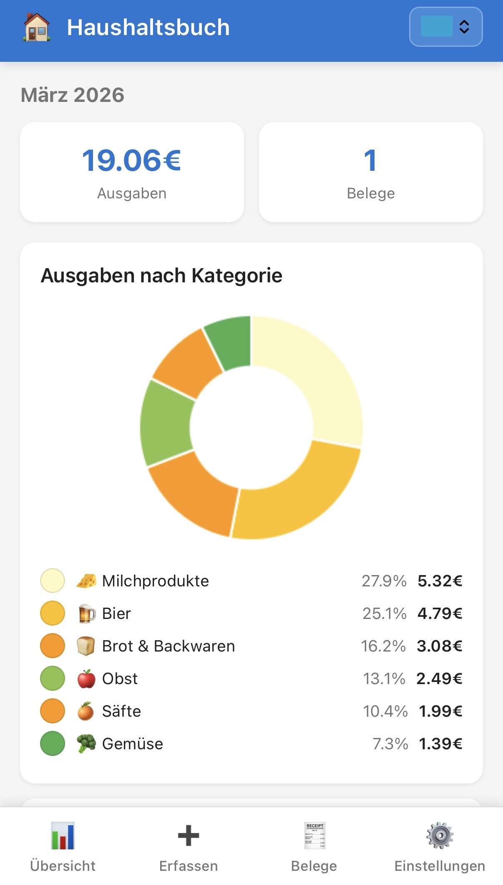
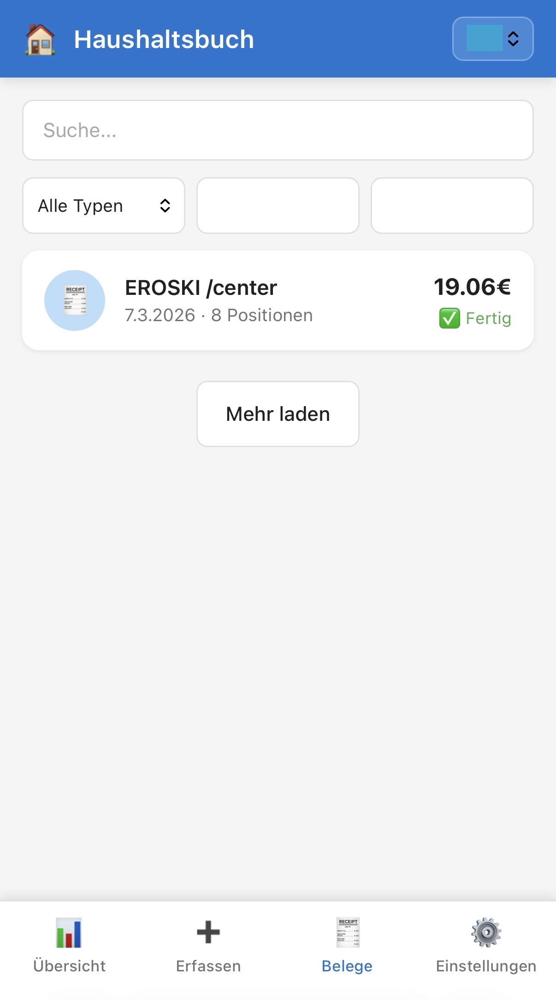
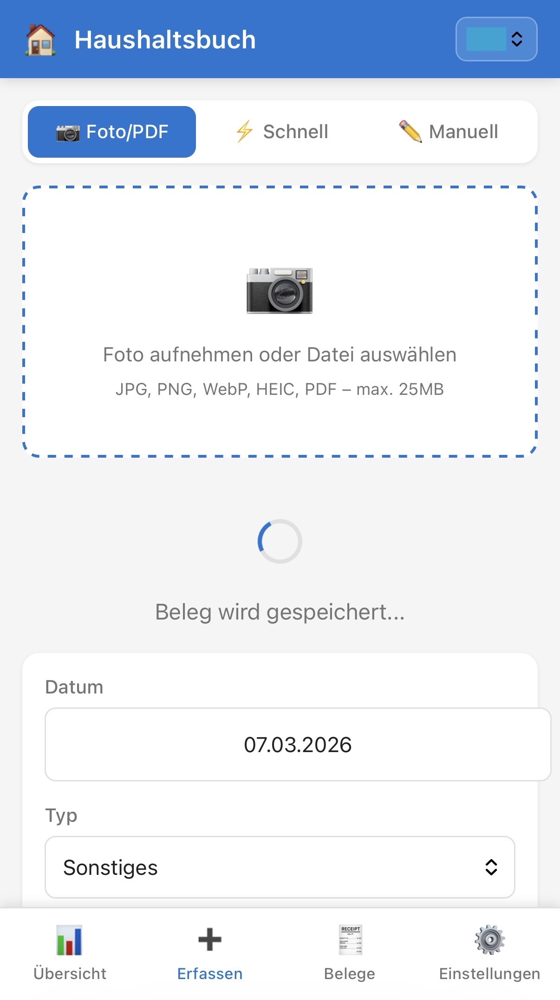

# KI-Haushaltsbuch

> ⚠️ **Work in progress.** This is a personal side project, actively developed but not production-ready. Expect rough edges.

> 🔓 **No authentication.** This app has no login system. Run it only inside your home network or behind a VPN — never expose it directly to the internet.

A self-hosted personal budget tracker as a Progressive Web App (PWA). Take a photo of a receipt with your phone — the app uses AI to automatically extract every line item and categorize it. See exactly where your money goes, not just "Groceries" but "Wine", "Vegetables", "Meat".

## Screenshots

<p align="center">
  
  
  
</p>

*Dashboard with category breakdown · Receipt list with AI-extracted line items · Photo capture with instant upload*

## Features

- 📷 **Scan receipts** — photo, PDF, HEIC all supported
- 🤖 **AI extraction** — Gemini 2.5 Flash reads store name, date, and every line item
- 🏷️ **Auto-categorization** — items are mapped to your category list automatically
- 📊 **Dashboard** — spending by category (pie chart) and month-over-month (bar chart)
- ✈️ **Multi-tenant** — separate books for different countries or contexts (e.g. Germany / Spain)
- 📥 **Export** — CSV and Excel download
- 📱 **PWA** — installable on iPhone and Android, works offline with upload queue
- 🌙 **Dark mode** — follows system preference

## Requirements

- Docker & Docker Compose
- A [Google AI Studio](https://aistudio.google.com/) API key (free tier available)

## Quick start

```bash
# 1. Copy config and add your API key
cp .env.example .env
# Edit .env: set GEMINI_API_KEY=...

# 2. Build and run
docker-compose up --build

# 3. Open in browser
# http://localhost:8080
```

On first launch a setup wizard asks you to create your first tenant (e.g. "Germany").

## Security notice

This app has **no authentication, no login, and no access control**. Anyone who can reach the port can see and modify all data. Intended deployment options:

- ✅ Behind your home router (local network only)
- ✅ Behind a VPN
- ✅ Behind a reverse proxy that handles authentication
- ❌ Not suitable for direct exposure to the public internet

## AI API keys

Keys can be set either in `.env` or in the app under **Settings** (stored in SQLite). `.env` takes precedence.

### Gemini 2.5 Flash (recommended)
Get a key at [Google AI Studio](https://aistudio.google.com/) — free tier is sufficient for personal use.
```
GEMINI_API_KEY=your-key-here
```

### Claude Haiku 4.5 (fallback)
Get a key at [Anthropic Console](https://console.anthropic.com/).
```
ANTHROPIC_API_KEY=your-key-here
AI_PROVIDER=claude
```

## Data persistence

The SQLite database and uploaded images live in `./data/` on the host (Docker volume). They survive container restarts and rebuilds.

**Backup:** copy `./data/haushaltsbuch.db` and `./data/uploads/`.

## Environment variables

| Variable | Description | Default |
|---|---|---|
| `AI_PROVIDER` | `gemini` or `claude` | `gemini` |
| `GEMINI_API_KEY` | Google AI Studio key | — |
| `ANTHROPIC_API_KEY` | Anthropic key | — |
| `PORT` | HTTP port inside container | `3000` |
| `TZ` | Timezone | `Europe/Berlin` |
| `UPLOAD_MAX_MB` | Max upload file size | `25` |
| `WORKER_INTERVAL_SEC` | AI worker polling interval | `10` |

## Install as PWA

- **iOS**: Safari → Share → "Add to Home Screen"
- **Android**: Chrome → Menu → "Install app"

## Architecture overview

```
Upload → HTTP 202 (instant)
              ↓
       SQLite job queue
              ↓  (worker polls every 10s)
       AI OCR job → AI categorization job
              ↓
       Receipt + line items stored in SQLite
```

Single Docker container. No external services. All AI calls are the only data leaving your server.

## License

[MIT](LICENSE) — feel free to use, fork, and adapt for your own needs.

---

*Personal project by Florian Wilhelm · Built with the assistance of [Claude Sonnet 4.6](https://www.anthropic.com/claude)*

*This project is also an experiment: the entire app — architecture, backend, frontend, and Docker setup — was developed in collaboration with Claude, without writing a single line of code manually. It explores what's possible when AI takes on the full implementation from a rough idea.*
